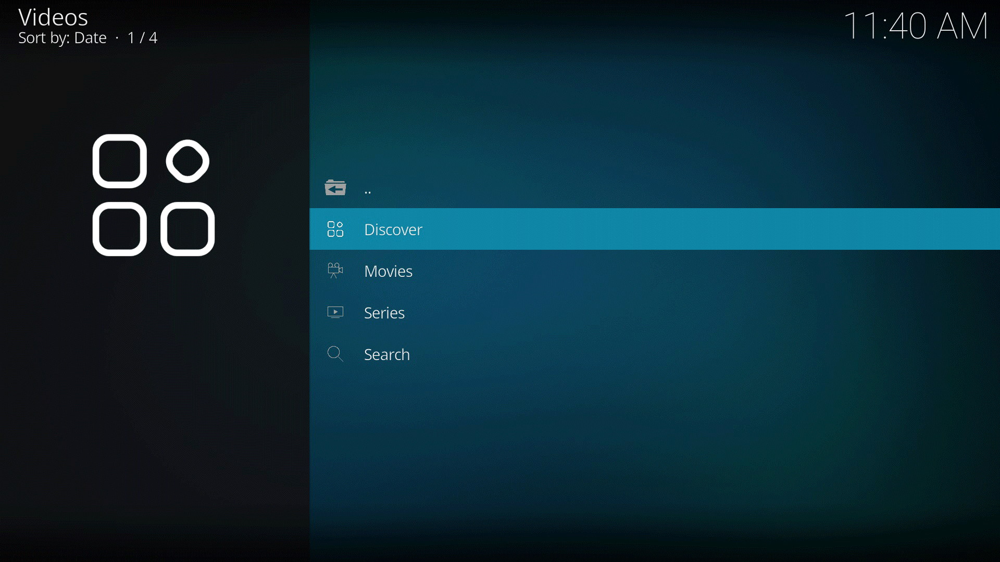

Flix
====

.. image:: https://readthedocs.org/projects/flix/badge/?version=latest
    :target: https://flix.readthedocs.io/en/latest/?badge=latest
    :alt: Documentation Status

.. image:: https://github.com/i96751414/plugin.video.flix/workflows/build/badge.svg
    :target: https://github.com/i96751414/plugin.video.flix/actions?query=workflow%3Abuild
    :alt: Build

.. image:: https://app.codacy.com/project/badge/Grade/b317e247ed704deb8a717505c8823d96
    :target: https://www.codacy.com/gh/i96751414/plugin.video.flix/dashboard?utm_source=github.com&amp;utm_medium=referral&amp;utm_content=i96751414/plugin.video.flix&amp;utm_campaign=Badge_Grade
    :alt: Codacy Badge

Flix, a movie scraper for `Kodi`_. It uses `TMDB`_ api for scraping data and allows for custom providers.

.. _Kodi: https://kodi.tv
.. _TMDB: https://www.themoviedb.org/

Features
--------

- Cross-platform.
- No extra service running in the background.
- Use of `TMDB`_ api for scraping data.
- Cache all api calls (this can be disabled in settings).
- Use of providers, if any, for playing media.
- Use of `OpenSubtitles <https://www.opensubtitles.org/>`_ api for searching subtitles.

What is a provider?
-------------------

Providers are normal `Kodi`_ script `addons <https://kodi.wiki/view/Add-ons>`_ and thus can be installed/updated/distributed just like any other addon.
However, a provider must follow a set of rules:

- The provider name must follow the format **script.flix.{name}**, otherwise it won't be discovered.
- Provide a `xbmc.python.script` extension point: see `this <https://kodi.wiki/view/HOW-TO:Script_addon>`_.
- Implement the `Provider` API: see `flix.provider.Provider <https://flix.readthedocs.io/en/latest/flix_api.html#flix.provider.Provider>`_.

See `script.flix.dummy <https://github.com/i96751414/script.flix.dummy>`_, a dummy provider mainly used for testing providers integration.

Installation
------------

The recommended way of installing this addon is through its `repository <https://github.com/i96751414/repository.github#installation>`_.
This way, any updates will be automatically installed.

Although **not recommended**, one can install the addon without installing its repository. To do so, get the
`latest release <https://github.com/i96751414/plugin.video.flix/releases/latest>`_ from github.
Please note that, if there are any additional dependencies, they won't be resolved unless the repository is installed.

Screenshots
-----------

